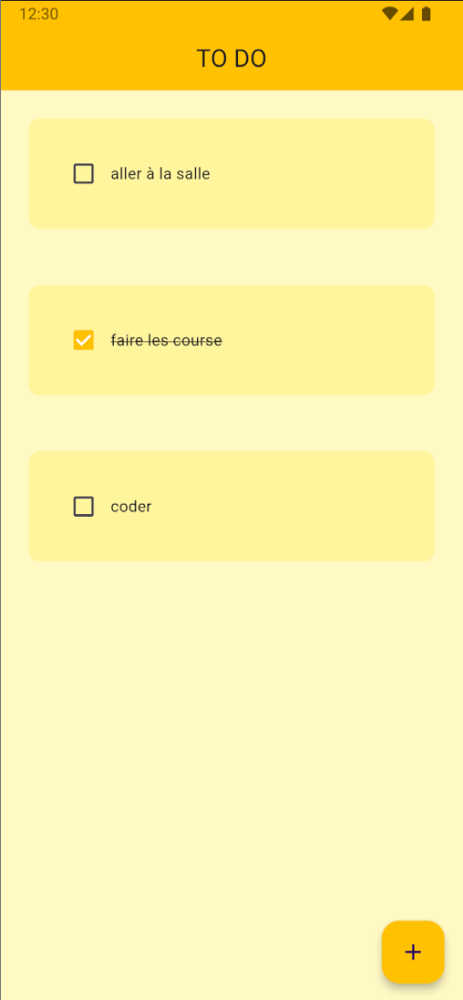

# 🔥 To-Do List Flutter App

Une application simple et élégante de liste de tâches créée avec Flutter. Cette application permet de gérer vos tâches quotidiennes efficacement tout en offrant une interface intuitive. ✍️

## 🌐 Aperçu
- Ajoutez de nouvelles tâches 🔍.
- Marquez les tâches comme complètes avec une case à cocher ☑️.
- Supprimez les tâches une fois terminées 🔒.

## 🤧 Fonctionnalités
- Interface utilisateur simple et moderne.
- Gestion intuitive des tâches.
- Utilisation de Hive pour le stockage local.
- utilisation de flutter sildaer pour la suppression des tâches.
- un reset de la liste de tâches. (à venir)

## 🔧 Prérequis
Assurez-vous d'avoir les outils suivants installés sur votre machine :

- Flutter SDK (version stable recommandée)
- Android Studio ou VS Code
- Un appareil ou émulateur Android / iOS pour tester l'application

## ⚙️ Installation
Suivez ces étapes pour lancer le projet localement :

1. Clonez le dépôt :
   ```bash
   git clone https://github.com/julienBelinga/Todo_List.git
   ```

2. Naviguez dans le répertoire du projet :
   ```bash
   cd todo_list
   ```

3. Installez les dépendances Flutter :
   ```bash
   flutter pub get
   ```

4. Lancez l'application sur un appareil ou un émulateur connecté :
   ```bash
   flutter run
   ```

## 📈 Structure du Projet

- **`lib/`** : Contient le code source principal de l'application.
  - **`main.dart`** : Point d'entrée de l'application.
  - **`components/`** : Composants réutilisables (DialogBox, TodoTile, etc.).

## ✨ Capture d'écran


## ❤️ Contributions
Les contributions sont les bienvenues ! N'hésitez pas à ouvrir une *issue* ou une *pull request* pour proposer des améliorations.

## 🚀 Roadmap
- [x] Version initiale avec ajout et suppression de tâches
- [x] Intégration de Hive pour le stockage local
- [ ] Amélioration de l'interface utilisateur avec des animations